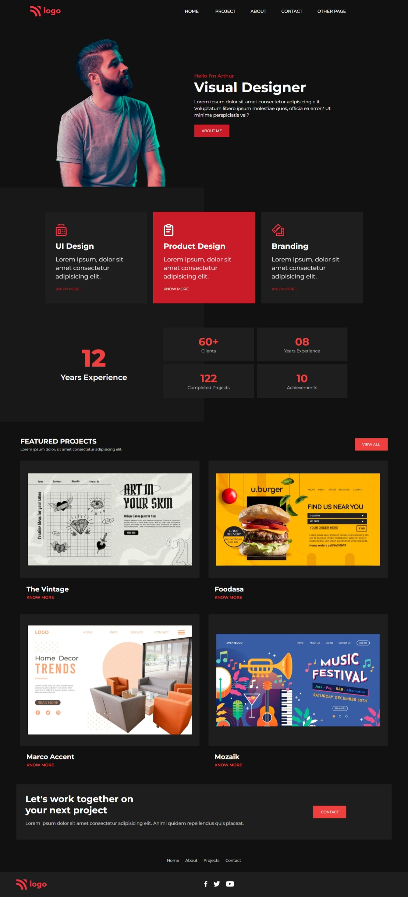

# Product Design Landing Page

## :link: [See it live](https://project-15-visual-designer-idbsdi1go.vercel.app/)

## :clipboard: Learning Outcomes 

- Learnt the split screen **background** and to place content over that. 
- Use of **font-awesome icons**
- Learnt how to make the responsive offset navigation

## :camera: Screenshot

